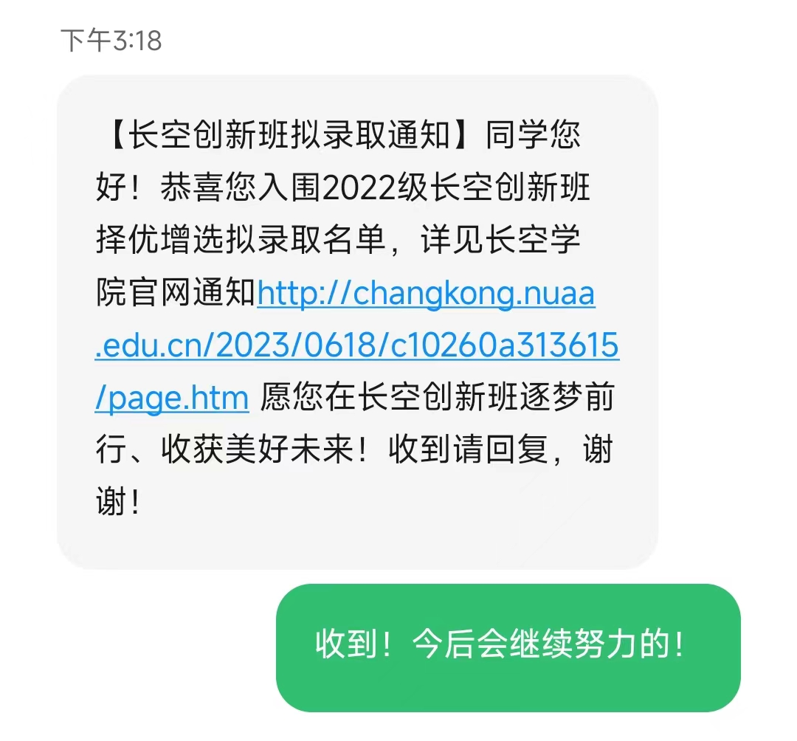

各位老师好，我叫杨语希，来自经济与管理学院，修读的专业是大数据管理与应用。因为高考分数的遗憾，我与长空创新班失之交臂。但是我对于航空航天的热情丝毫未减，来南航的这一年里，我既保持了专业第二的绩点、收获了各类奖项，也找到了自己的热爱和发展方向。所以今天能够这么荣幸地坐在这里，我认为是幸运也是必然。

之所以如此迫切地希望来到长空创新班，是因为长空创新班的个性化培养方案以及学术、科研氛围都和我的个人发展目标一致，自主的探索以及专业的指导正是我所向往的。我热爱航空航天，热衷钻研问题，总是喜欢抛出一些别人没想到的问题，科任老师经常会说：你能沉下心来的性格很适合科研。大一这一年，我习惯到图书馆看书和思考，不断摸索未来的方向。我扎实了自身的基础知识，参加了一些比赛，比如因为喜欢研究数学，在高数省赛获得二等奖；还参与了一项大创，目前我正在为大二正式接触科研、自己主持大创打基础；最近也和长空学院的两名同学组成队伍，规划在暑假为数模国赛做准备。我想，如果要简单概括我自己，大概就是：踏实、坚定、有规划、有力量。我喜欢创新地思考，但是用最朴素的努力去实现它。

对于未来的规划其实挺纯粹的。因为我的专业和计算机相关，所以我未来想往电类方向发展，把航空航天和计算机融合，既能利用我这一年积累的计算机基础，也能继续为我热爱的航空航天做出贡献。并且我已经下定决心在学术领域不断钻研下去，最后留校成为一名学者，因为在初入大学的这一年中，我已经被老师们治学的严谨和对待科研工作的认真所打动，真正体会到了科研对我来说的意义。我特别憧憬有一天自己能成为这样一位科研工作者，用自己的付出打造出对社会有用的成果，同时也作为榜样来感染我的学生，让更多的人和我一样体会到学术和科研的魅力。

以上是我的自我介绍，谢谢。

